# Medical Portal - Mermaid Diagrams

This document contains all the Mermaid diagrams for the Medical Portal system design.

---

## 1. System Architecture Diagram


---

## 2. User Authentication Flow


---

## 3. Disease Prediction Flow


---

## 4. Doctor Consultation Flow


---

## 5. Database Entity Relationship Diagram


---

## 6. User Roles and Permissions Matrix

```mermaid
flowchart LR
    subgraph Features["Features"]
        Homepage["View Homepage"]
        SignupLogin["Signup/Login"]
        SymptomPred["Symptom Prediction"]
        ImagePred["Image Prediction"]
        DoctorList["View Doctor List"]
        StartConsult["Start Consultation"]
        Chat["Chat with Doctor"]
        RateReview["Rate/Review"]
        Dashboard["View Dashboard"]
        Analytics["View Analytics"]
        AdminDash["Admin Dashboard"]
        UserMgmt["User Management"]
        ViewFeedback["View Feedback"]
    end
    
    subgraph Roles["User Roles"]
        Guest["👤 Guest"]
        Patient["🏥 Patient"]
        Doctor["👨‍⚕️ Doctor"]
        Admin["👔 Admin"]
    end
    
    Guest -->|"✅"| Homepage
    Guest -->|"✅"| SignupLogin
    
    Patient -->|"✅"| Homepage
    Patient -->|"✅"| SignupLogin
    Patient -->|"✅"| SymptomPred
    Patient -->|"✅"| ImagePred
    Patient -->|"✅"| DoctorList
    Patient -->|"✅"| StartConsult
    Patient -->|"✅"| Chat
    Patient -->|"✅"| RateReview
    Patient -->|"✅"| Dashboard
    Patient -->|"✅"| Analytics
    
    Doctor -->|"✅"| Homepage
    Doctor -->|"✅"| Dashboard
    Doctor -->|"✅"| Chat
    
    Admin -->|"✅"| Homepage
    Admin -->|"✅"| AdminDash
    Admin -->|"✅"| UserMgmt
    Admin -->|"✅"| ViewFeedback
```



---

## 7. URL Routing Structure

```mermaid
flowchart TB
    subgraph Root["Root URL Conf"]
        direction TB
        Admin["admin/"]
        Main[""""]
        Accounts[""""]
        Chats[""""]
    end
    
    subgraph MainApp["main_app/urls.py"]
        direction LR
        Home["home"]
        PatientUI["patient_ui"]
        CheckDisease["checkdisease"]
        ScanImage["scan_image"]
        Analytics["disease_analytics_dashboard"]
        ConsultDoctor["consult_a_doctor"]
        MakeConsult["make_consultation/<doctorusername>"]
        DoctorUI["doctor_ui"]
        ConsultView["consultationview/<consultation_id>"]
        ChatPost["post"]
        ChatMessages["chat_messages"]
    end
    
    subgraph AccountsApp["accounts/urls.py"]
        direction LR
        SignupPatient["signup_patient"]
        SigninPatient["sign_in_patient"]
        SignupDoctor["signup_doctor"]
        SigninDoctor["sign_in_doctor"]
        SigninAdmin["sign_in_admin"]
        Logout["logout"]
    end
    
    subgraph ChatsApp["chats/urls.py"]
        direction LR
        PostFeedback["post_feedback"]
        GetFeedback["get_feedback"]
    end
    
    Root --> Admin
    Root --> Main
    Root --> Accounts
    Root --> Chats
    
    Main --> Home
    Main --> PatientUI
    Main --> CheckDisease
    Main --> ScanImage
    Main --> Analytics
    Main --> ConsultDoctor
    Main --> MakeConsult
    Main --> DoctorUI
    Main --> ConsultView
    Main --> ChatPost
    Main --> ChatMessages
    
    Accounts --> SignupPatient
    Accounts --> SigninPatient
    Accounts --> SignupDoctor
    Accounts --> SigninDoctor
    Accounts --> SigninAdmin
    Accounts --> Logout
```

---

## 8. Deployment Architecture


---

## 9. Data Flow Diagram - Symptom Prediction


---

## 10. Data Flow Diagram - Image Prediction


---

**Document Version:** 1.0  
**Last Updated:** 2024

