# Medical Portal - UML Diagrams

This document contains comprehensive UML diagrams for the Medical Portal system including Class Diagrams, Sequence Diagrams, Use Case Diagrams, Activity Diagrams, and Component Diagrams.

---

## Table of Contents

1. [Use Case Diagrams](#1-use-case-diagrams)
2. [Class Diagrams](#2-class-diagrams)
3. [Sequence Diagrams](#3-sequence-diagrams)
4. [Activity Diagrams](#4-activity-diagrams)
5. [Component Diagrams](#5-component-diagrams)
6. [State Diagrams](#6-state-diagrams)

---

## 1. Use Case Diagrams

### 1.1 Overall Use Case Diagram

```plantuml
@startuml
left to right direction
skinparam packageStyle rectangle

actor "Guest" as Guest
actor "Patient" as Patient
actor "Doctor" as Doctor
actor "Admin" as Admin

rectangle "Medical Portal" {
  
  -- Authentication --
  usecase "Login" as UC1
  usecase "Register" as UC2
  usecase "Logout" as UC3
  
  -- Disease Prediction --
  usecase "Symptom-based\nPrediction" as UC4
  usecase "Image-based\nPrediction" as UC5
  usecase "View Prediction\nHistory" as UC6
  
  -- Doctor Consultation --
  usecase "View Doctors" as UC7
  usecase "Request\nConsultation" as UC8
  usecase "Chat with Doctor" as UC9
  usecase "Close Consultation" as UC10
  
  -- Rating & Review --
  usecase "Rate Doctor" as UC11
  usecase "Write Review" as UC12
  
  -- Analytics --
  usecase "View Analytics\nDashboard" as UC13
  
  -- Admin Functions --
  usecase "View Feedback" as UC14
  usecase "Manage Users" as UC15
  usecase "View Reports" as UC16
}

Guest --> UC1
Guest --> UC2

Patient --> UC1
Patient --> UC3
Patient --> UC4
Patient --> UC5
Patient --> UC6
Patient --> UC7
Patient --> UC8
Patient --> UC9
Patient --> UC11
Patient --> UC12
Patient --> UC13

Doctor --> UC1
Doctor --> UC3
Doctor --> UC9
Doctor --> UC10

Admin --> UC1
Admin --> UC3
Admin --> UC14
Admin --> UC15
Admin --> UC16

@enduml
```

### 1.2 Patient Use Case Diagram

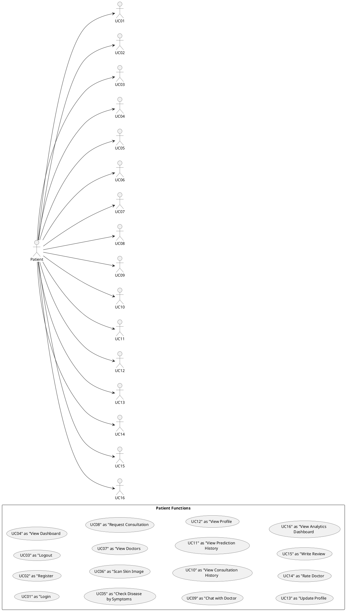

### 1.3 Doctor Use Case Diagram

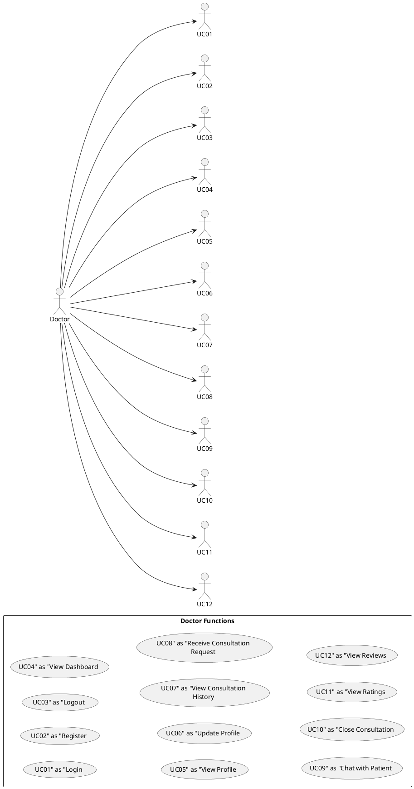

---

## 2. Class Diagrams

### 2.1 Core Domain Model Class Diagram

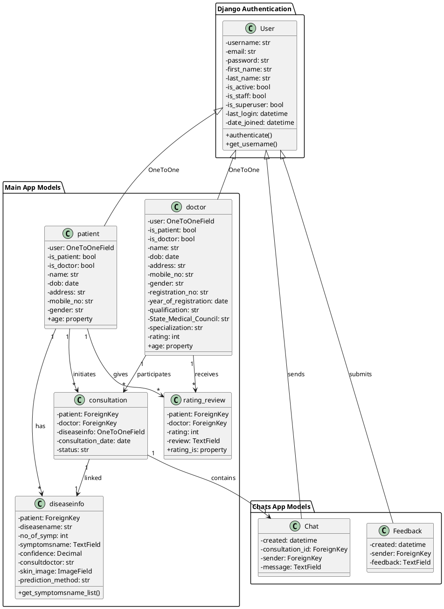

### 2.2 View/Controller Class Diagram

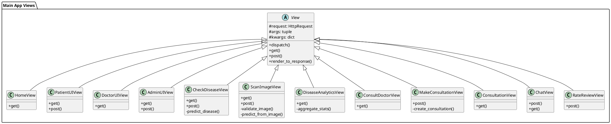

### 2.3 Accounts/Auth Class Diagram

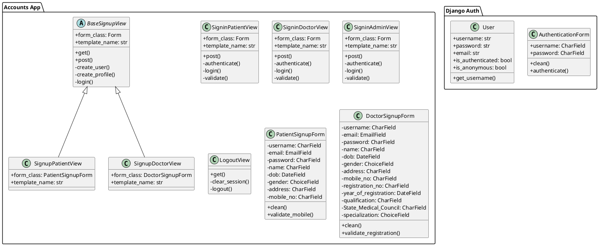

---

## 3. Sequence Diagrams

### 3.1 Patient Login Sequence

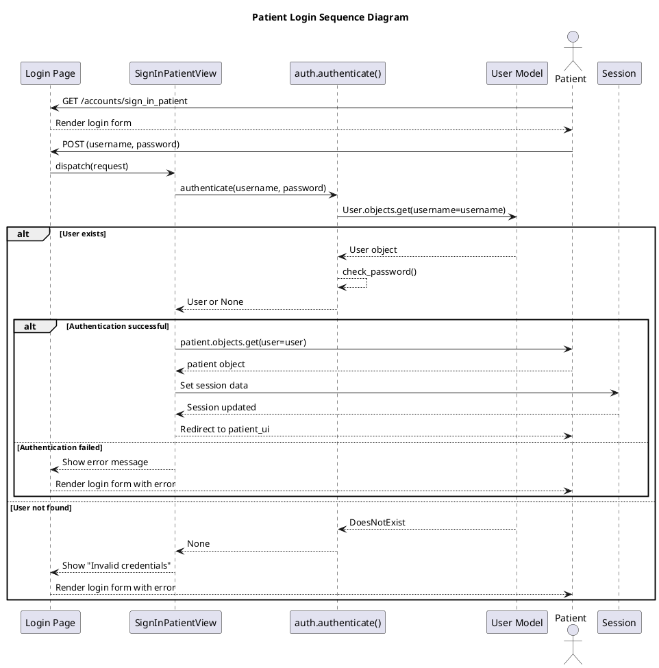

### 3.2 Symptom Prediction Sequence

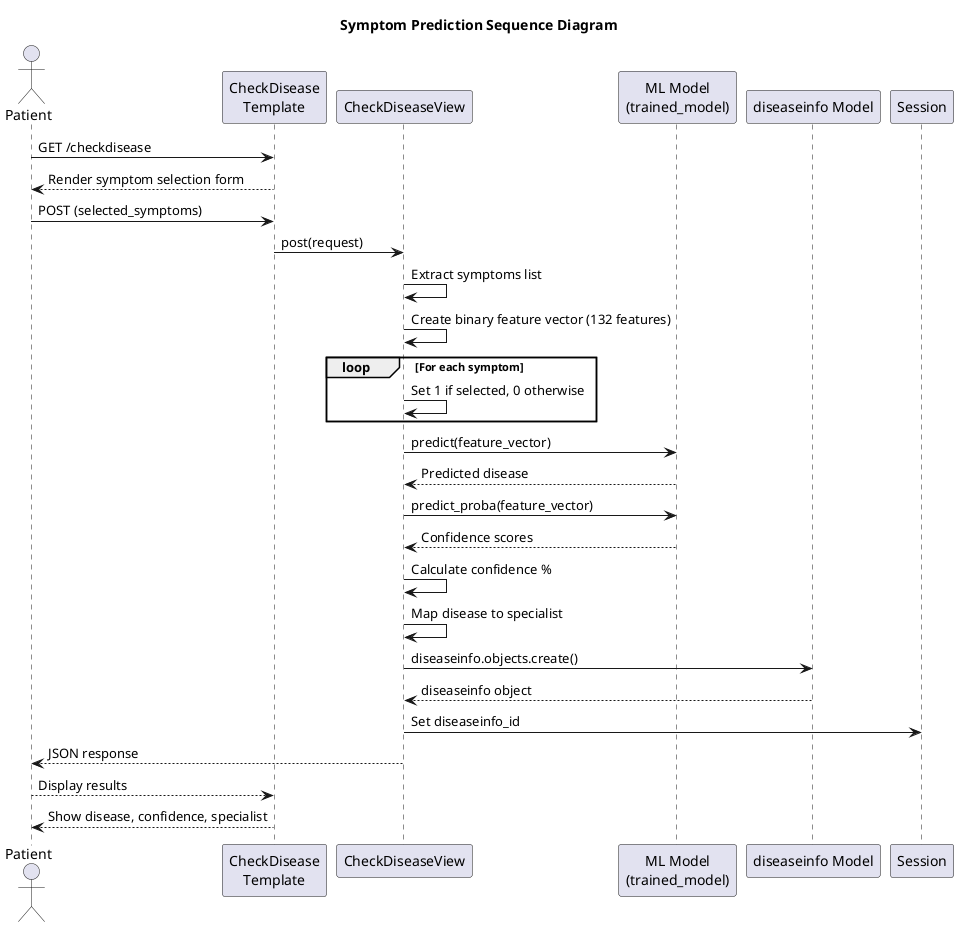

### 3.3 Image Prediction Sequence

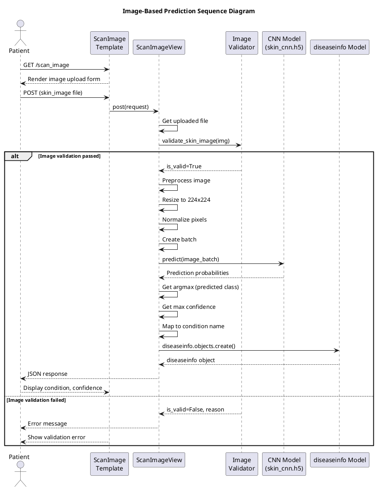

### 3.4 Consultation Request Sequence

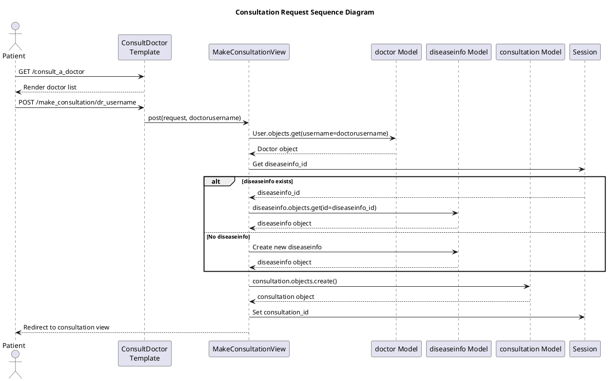

### 3.5 Chat Message Sequence

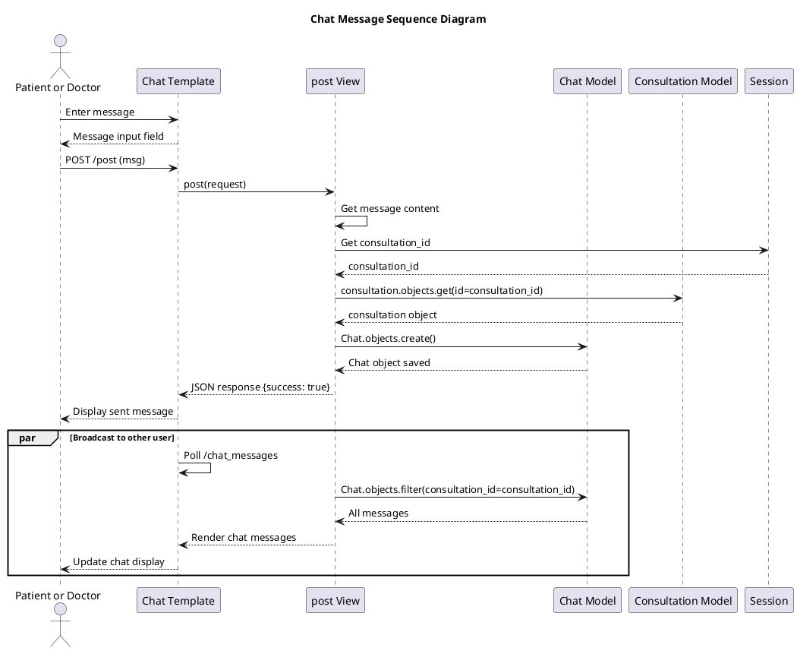

---

## 4. Activity Diagrams

### 4.1 Patient Activity Diagram

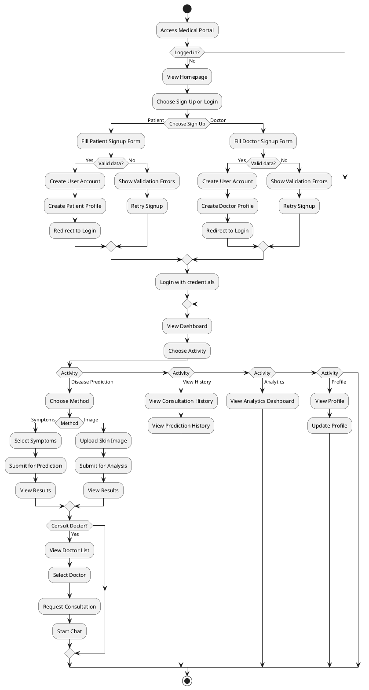

### 4.2 Disease Prediction Activity Diagram

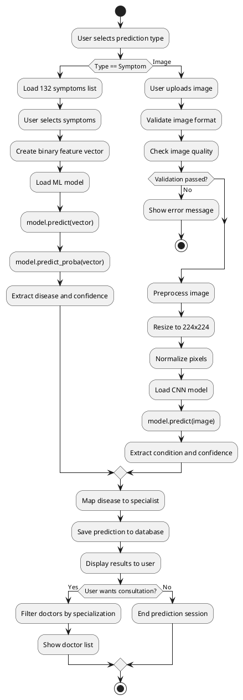

### 4.3 Consultation Lifecycle Activity Diagram

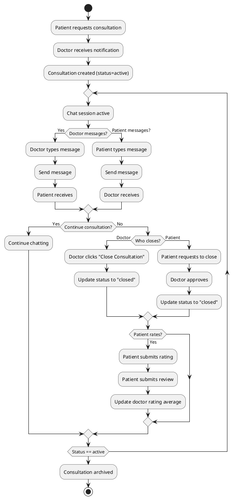

---

## 5. Component Diagrams

### 5.1 System Component Diagram

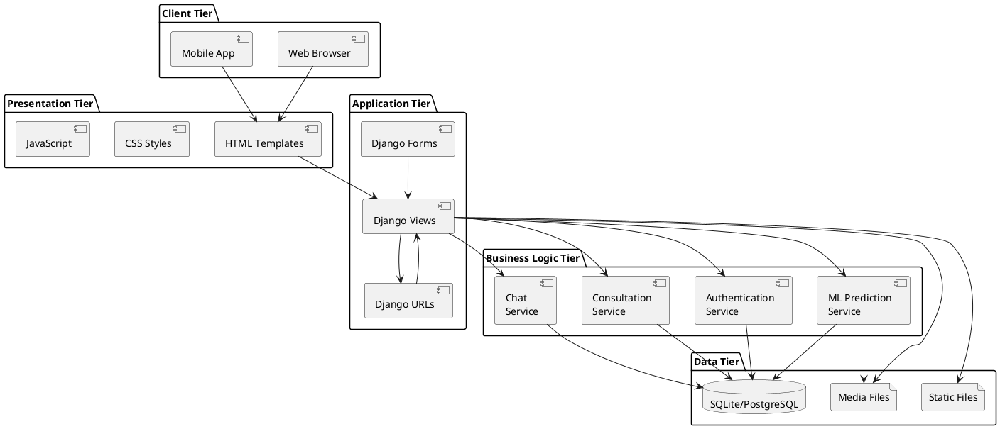

### 5.2 ML Component Diagram

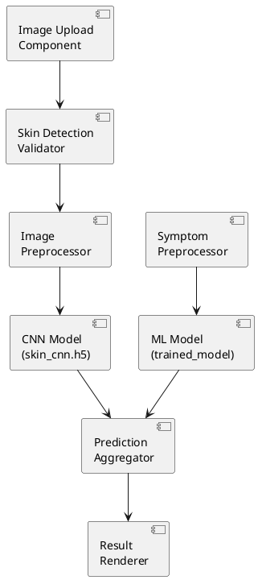

---

## 6. State Diagrams

### 6.1 Consultation State Diagram

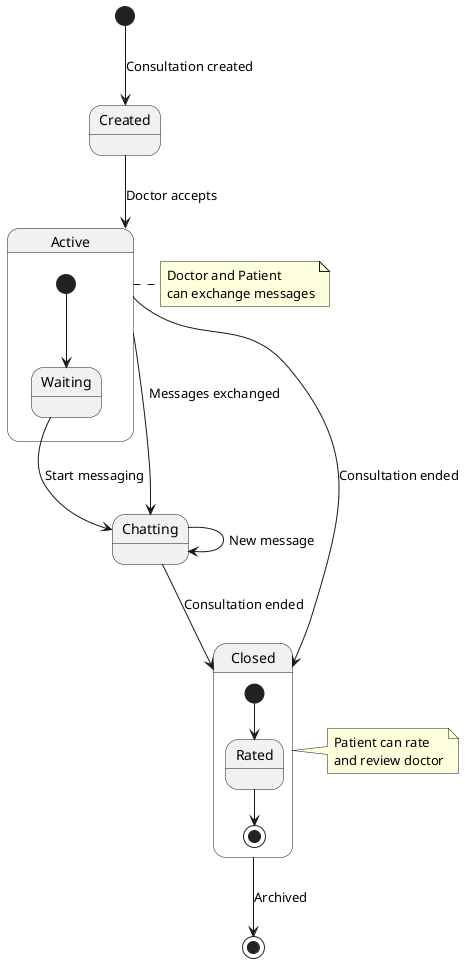

### 6.2 User Authentication State Diagram

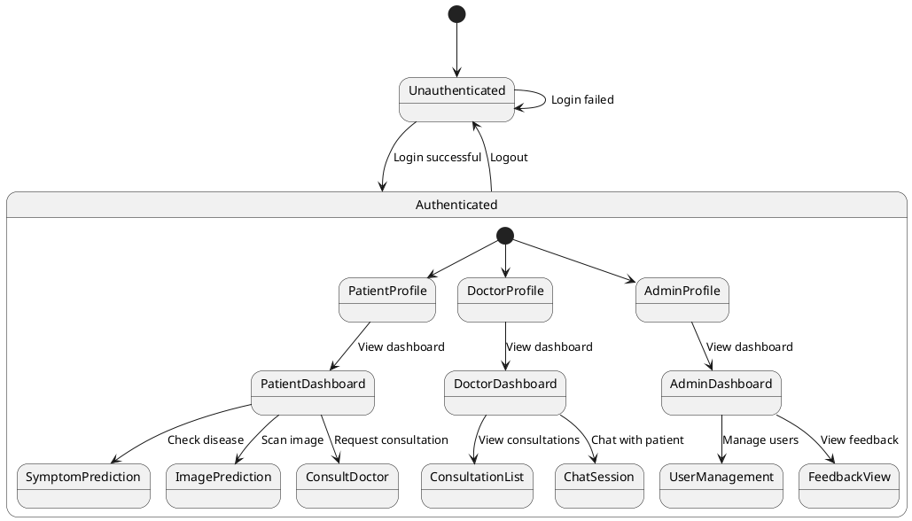

### 6.3 Prediction State Diagram

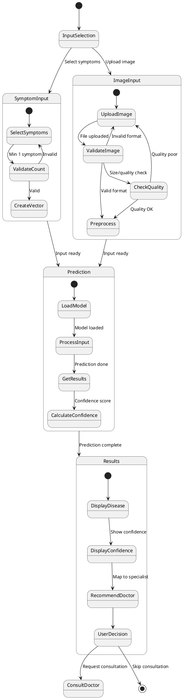

---

**Document Version:** 1.0  
**Last Updated:** 2024

